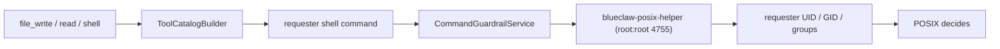
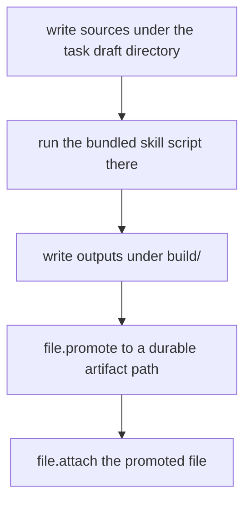

# Blueclaw Architecture

The ledger vocabulary is declared in bluecollar's
`taskstate/task_event_name.go` and generated into the protocol as
`task-event-name`; the model-facing [tool catalog](tool-catalog.md) is generated
from the code that registers it. Neither is edited here.

This document describes the runtime as it is built today, for someone who wants
to modify it. [`README.md`](../README.md) covers what Blueclaw is, how to run
it, and the security claim; this file is the longer version of the layering and
the boundary, citing the functions that hold each rule.

Line numbers are accurate at the time of writing and drift with refactors; the
function names beside them are the durable reference.

## Layers

| Layer | Owns | Package |
|---|---|---|
| Host | connectors, policy, identity, task store, approvals, tool catalog, memory, delivery, POSIX projection | `internal/`, `cmd/` |
| Harness selection | which loop runs, from `agent.harness.name` | `internal/harnessselection`, `internal/harnessdriver` |
| Harness | the agent loop: run a turn and report what happened | `.dependency/bluecollar` (in-process), `internal/acpharness`, `internal/cliharness` |
| Harness boundary | what an out-of-process agent may reach and what its turn achieved | `internal/mcpserver`, `internal/approvalgate`, `internal/turnoutcome`, `internal/security` |
| Contract | the types both compile against, and the harness port | `.dependency/bluecollar/agentcontract/`, `.dependency/bluecollar/toolcontract/`, `.dependency/bluecollar/taskstate/` |
| Operator surface | enrollment, the terminal UI | `internal/enrollment`, `internal/tui`, `cmd/blueclaw-cli` |

### Running a harness that is not this repository's

`harnessselection.Select` maps `agent.harness.name` to a factory and is the only
place a harness is named. Nothing downstream branches on the name; it reaches
`mcpserver.HarnessSession` as a label and no further.

An out-of-process harness changes three things and only three:

1. **Where it runs.** `internal/security.StartProcess` starts the agent inside
   the requester's POSIX identity. Both external harnesses refuse the turn
   outright when that boundary is not configured, because an agent that brings
   its own `bash` would otherwise run as the service account.
2. **How it reaches tools.** It cannot call into the host's process, so
   `internal/mcpserver` publishes the requester's catalog over MCP with a
   session token that is revoked when the turn ends. Every call still executes
   here, as the requester.
3. **How the outcome is known.** The bundled loop reports a task status. An ACP
   agent reports only that its turn ended, and a CLI agent reports only an exit
   code — neither means the work succeeded. `internal/turnoutcome` decides the
   status from the agent's final message and the catalog tools that actually
   ran and succeeded, which is a fact the host owns and the harness cannot
   forge.

`internal/acpharness` speaks [ACP](https://agentclientprotocol.com) over stdio.
`internal/cliharness` drives an agent that has a command line instead of a
protocol; each supported CLI is a descriptor of flags and an output parser
(`ClaudeCodeAgentCommand`, `CodexAgentCommand`, `AntigravityAgentCommand`), not
a branch in the host.

The port is `agentcontract.Harness` (`.dependency/bluecollar/agentcontract/harness.go`), a single
method:

| Method | Called from |
|---|---|
| `RunTurn` | `internal/agentruntime/task_launcher.go` (`runTurnLaunchStep.Run`) |

Turn routing, which used to be a harness method (`RouteTurn`), is now host
policy: `ConnectorRuntime.planTurn` (`internal/connectors/runtime.go`) and
`TaskLauncher.routedTurnDecision` (`internal/agentruntime/task_launcher.go`)
both drive an `intake.TurnRouter` directly instead of asking the harness to
route. Addressing and active-task-follow-up classification moved the same
way, behind the host's own `IntakeClassifier` port
(`internal/connectors/runtime.go`), implemented by `intake.NewClassifier`
(wired in `internal/app/application.go`).

Everything else the host needs from a task — events, cancellation, run lookup,
completion — it takes from `taskstate.TaskRunService` directly. Those methods
were removed from the kernel deliberately; do not reintroduce store passthrough
on the harness.

`.dependency/bluecollar/contract.go` is the alias shim. It asserts
`*AgentKernel` satisfies the port; the `type (...)` block re-exports the types
that moved to `agentcontract` so the ~130 Go files naming `AgentTurnRequest`,
`VisibleContext`, `InstructionBundle`, `MemoryFact` and their closure did not
have to change. Go's implicit interfaces need type identity, which is why the
definitions had to move rather than being duplicated.

The port is now the only path. `ConnectorRuntime` names no harness type, and
the harness arrives as a factory chosen at startup by `agent.harness.name`
(`internal/harnessselection/selection.go`), passed in from `cmd/blueclaw/main.go`.

## Deployment shape

- InternKim is a headless computer the customer owns. It accepts no inbound connection; how an operator reaches it is their own network's business.
- Blueclaw runs inside a long-lived virtual-machine guest with an immutable root filesystem.
- The host mounts exactly one writable path into the guest: `workspace`.
- Persistent application data lives under `workspace/.blueclaw`.
- Mattermost is self-hosted on the host beside the guest, not inside it.
- Blueclaw is configured and operated from the user's main computer over SSH and HTTP.

```text
  Mattermost users / admin channel
          ^
          |
          v
  +-----------------------------------+
  | InternKim hardware                |
  |                                   |
  |  headless host OS                 |
  |    - tiny supervisor              |
  |    - capability sidecars          |
  |    - workspace volume             |
  |    - self-hosted Mattermost       |
  |                                   |
  |  isolated guest                   |
  |    - blueclaw daemon              |
  |    - postgres                     |
  |    - admin API                    |
  |    - task inbox API               |
  |    - policy engine                |
  |    - memory engine                |
  +-----------------------------------+
          ^                     ^
          |                     |
          v                     v
  +-----------------------------------+
  | user's main computer              |
  |    - SSH client                   |
  |    - admin/task UI client         |
  |    - companion bridge             |
  |    - browser instance             |
  |    - user approval surface        |
  +-----------------------------------+
```

The trust boundary is deliberate: long-lived secrets and memory stay on the
appliance, agent work executes inside the guest, and the user's own machine is
used only for browser handoff, approval, and interactive login.

A standalone deployment drops the virtual-machine guest, the capability sidecars,
and the tunnel; `cmd/blueclaw` is an ordinary process against Postgres and one
OpenAI-compatible model endpoint. See the README's install section.

## Boot sequence

`app.NewApplication` (`internal/app/application.go`) runs, in order:

| Stage | What it does |
|---|---|
| `open_database` | opens Postgres; every repository below is skipped when `database.SQL` is nil, so the daemon boots without it |
| `load_policy` | reads the policy document from `--policy` |
| `posix_synchronize` | `security.POSIXSynchronizer.Synchronize` applies users, groups, and directory modes through the setuid helper |
| `project_policy` | upserts the read-only `person` projection |
| `identity` | builds the identity service and platform account links |
| `agent_kernel` | constructs the harness and injects instruction bundle, tiers, skills, company context |
| `memory` | terminal service, memory service, optional Graphiti graph store |

Migrations run from `database.migrationDirectoryPath`, default `migrations`
(`internal/app/application.go-895`).

## Connectors

Blueclaw never holds platform credentials. Sidecars own Mattermost WebSocket
ingress, Slack Events API or Socket Mode, and Signal sessions, along with every
platform token. They forward normalized events to
`POST /connectors/{platform}/events`.

Ingress routes are registered in `internal/httpserver/router.go-87`:
`mattermost`, `slack`, `signal`, `api`, `buzz`.

| Platform | Purpose |
|---|---|
| `mattermost` | primary production collaboration surface |
| `slack` | optional external adapter on the same connector runtime |
| `signal` | optional external adapter, off by default |
| `api` | direct programmatic task submission, addressed by requester email |
| `buzz` | relay-based messenger with per-user identities rather than one bot account |

### Where to plug a new platform in

A new platform is an adapter, not a new runtime. The three seams:

| Seam | Type | Location |
|---|---|---|
| inbound normalization | `PlatformInboundEvent` | `internal/connectors/runtime.go` |
| outbound delivery | `PlatformAdapter`, registered with `RegisterAdapter` | `internal/connectors/runtime.go` |
| transport choice | capability call, or `chatd` HTTP | `internal/connectors/capability_platform_adapter.go`, `internal/connectors/chatd_platform_adapter.go` |

Inbound events enter through `HandleHTTPEvent`
(`internal/connectors/runtime.go`) or `HandleRealtimeEvent`, both
converging on `HandleInboundEvent`, which either handles the event
immediately or enqueues it.

Minimal normalized event body:

```json
{
  "conversationID": "opaque-conversation-id",
  "messageID": "opaque-message-id",
  "senderID": "opaque-sender-id",
  "replyTargetID": "opaque-reply-target-id",
  "prompt": "current user message",
  "context": {
    "messages": [{ "speaker": "admin", "text": "previous visible message" }],
    "hasMoreBefore": true,
    "historyCursor": "opaque-history-cursor"
  }
}
```

Outbound delivery either calls the capability layer directly or routes through
`chatd`, the TypeScript chat bridge, per platform:

```json
"connectors": {
  "mattermost": {},
  "slack": {},
  "signal": { "enabled": false },
  "chatd": { "endpoint": "http://127.0.0.1:18090", "enabledPlatforms": [] }
}
```

Blueclaw owns idempotency, invited-email authorization, task creation, progress
orchestration, reply decisions, and structured logs. Typing indicators and
progress publication are optional capability calls, not Blueclaw platform API
calls. Sidecars suppress bot and self messages before forwarding. Connector logs
use `connector.<platform>.<stage>` event names.

### Durability

Delivery is durable rather than fire-and-forget. Inbound events persist in
`raw_event` with a `pending`/`running`/`succeeded`/`failed` status, and replies
enqueue into `connector_outbox` referencing the originating event. Synthetic
resume sources — auto-resume after a runtime restart, ask-choice resolution,
steer — also create a backing `raw_event` row so the outbox foreign key holds.
Background workers claim stale rows with retry and backoff, duplicate inbound
events return the stored result instead of re-running, and the health check
fails on missing connector schema or excessive backlog.

Runtime configuration is secretless. The guest reaches the capability layer over
vsock; a Unix socket is used only in non-guest development layouts.

```json
"capabilities": {
  "transport": "vsock",
  "endpoint": "http://internkim-capability",
  "vsockCID": 2,
  "vsockPort": 7000,
  "timeoutSecond": 15
}
```

## Turn lifecycle

An inbound message becomes at most one task run. The path, end to end:

1. **Ingress.** `ConnectorRuntime.HandleInboundEvent`
   (`internal/connectors/runtime.go`) persists the raw event, resolves the
   sender to a policy person, and refuses uninvited accounts.
2. **Addressing.** For channel messages the runtime asks its `IntakeClassifier`
   whether the bot was addressed at all — `ClassifyAddressing`
   (`internal/connectors/inbound_engagement.go`, implemented by
   `intake.NewClassifier`). The decision is a four-outcome choice: ignore,
   react only, reply, or react and reply.
3. **Busy routing.** If the person already has an active task,
   `ConnectorRuntime.planTurn` (`internal/connectors/runtime.go`) and
   `ClassifyActiveTaskFollowUp` (`internal/connectors/busy_message.go`,
   `internal/connectors/task_control.go`) decide between steering the running
   task, replacing it, answering status, or starting a second one.
   `BusyRoute*` constants are in `.dependency/bluecollar/agentcontract/turn_decision.go`.
4. **Launch.** `TaskLauncher.Launch`
   (`internal/agentruntime/task_launcher.go`) runs an ordered pipeline of
   launch steps, each recorded as an event so a failure names its step:
   `provisionRequesterWorkspaceLaunchStep` →
   `buildToolSetLaunchStep` → `auditToolRegistryLaunchStep` →
   `loadMemoryLaunchStep` → `runTurnLaunchStep`.
5. **Turn.** `AgentKernel.RunTurn`
   (`.dependency/bluecollar/agent_kernel.go`) plans the turn with the turn
   router, then hands execution to `AgentTurnRunner.RunTurn`
   (`.dependency/bluecollar/turn_runner.go`).
6. **Delivery.** The result enqueues into the connector outbox and is dispatched
   by `internal/connectors/task_reply_dispatch.go`.

### Inside the turn

- **Task** is one user request lifecycle, from intake through the final reply or reaction.
- **Step** is one internal progress unit inside a Task. A Step either runs one tool with `continue`, or closes the Task with `finish`/`fail`.
- **Checkpoint** is optional user-visible progress text on a `continue` Step. It never closes the Task, and the tool still runs in the same Step.
- **Final Step** runs no tool and must send the reply, failure reply, or reaction that closes the Task.

The turn contract is a discriminated union of four actions, defined in
`protocol/src/agent.ts-138`:

| Action | Carries |
|---|---|
| `continue` | `toolName`, `toolInput` |
| `set_quality_criteria` | `qualityCriteria` |
| `finish` | `message`, `completionEvidenceIDs`, `qualityReview`, `goalStatus: satisfied` |
| `fail` | `reason`, `goalStatus: blocked`, optional `usedFailureFacts` |

Every action carries an `executionStateUpdate` — `workspace`, `knownFacts`,
`triedAndFailed`, `currentBlocker`, `nextPlan`, `wasCompacted`. This is the
model's own running notes, threaded forward across steps so a long task keeps
its bearings without re-reading the whole observation stream. It replaced an
earlier per-step plan object whose fields the model spent tokens filling and the
runtime mostly ignored.

`RunTurn` (`turn_runner.go`) sets up the turn: it injects requester identity
into the model request context, restores prior state from the task
event ledger (`agentTaskStateForTurn`), registers a cancel function against
the run, wraps the language model so every call is recorded as an
`llm.call` event (`:265-273`), and derives a work context from the effort budget.

One structured action document per step is a deliberate divergence from native
multi-step tool calling, and it is on the list to change: it forbids parallel
tool calls, adds a large envelope to every request, and cannot be expressed by
an AI SDK harness adapter without a lossy translation. The completion and
approval gates that currently ride inside the action document are separable and
stay.

### Tool exposure

Tool exposure is separate from all of this. Extension tool schemas offered to
the model are capped at `maxExtensionCallableToolCount` (15, in
`.dependency/bluecollar/tool_exposure.go`); kernel tools are added on top of that
cap (`toolSetForAgentTurnWithExposure:41-45`). Groups are ordered by priority —
required interaction, recovery, pending working-set tool, required evidence,
pinned, selected skills, evidence alternatives — and whatever does not
fit is reported as a dropped group in the exposure event rather than silently
disappearing.

### Completion gates

Completion gates are independent from tool visibility. A `finish` must name the
observations that prove the work happened
(`.dependency/bluecollar/completion_gate.go`,
`.dependency/bluecollar/completion_judge.go`), and draft or setup evidence such as
site creation cannot close a publish Task without the required build, review,
publish, and final status evidence. Contract verification runs only when the
task has explicit outcome requirements; empty contracts stay on the fast path.

### Approvals

Approval is a runtime pause and a verbatim re-execution, not a prompt
instruction. `.dependency/bluecollar/approval_gate.go`:

| Concern | Function |
|---|---|
| does this call need approval | `toolCallRequiresRuntimeApproval`, `approvalScopeForTool` |
| pause and ask | `requestHeldCallApproval`, wording generated by the model at `generateHeldCallConfirmationWording` |
| resume | `executeApprovedHeldCall`, matched against the held call by `isApprovedHeldCallVerbatimMatch` |
| task-scoped reuse | `taskAlreadyApprovedScope`, `taskApprovedScopes` |

The scope comes from the tool descriptor's `ApprovalScope`
(`.dependency/bluecollar/toolcontract/registry.go`), not from the tool's name. An approved call is
re-executed exactly as it was held; a modified call is a new approval.

`ask_input`, `ask_confirm`, and `ask_choice` are outside grant reuse — they are
questions, not grants.

## Task store

`.dependency/bluecollar/taskstate/` is the durable state of a run and is host-owned, not harness-owned.

| Type | File |
|---|---|
| `TaskRunStore`, `TaskStepStore`, `TaskArtifactStore` interfaces | `.dependency/bluecollar/taskstate/store.go`, ,  |
| run lifecycle | `.dependency/bluecollar/taskstate/task_run_service.go` |
| event ledger | `.dependency/bluecollar/taskstate/task_event_service.go` |
| steps | `.dependency/bluecollar/taskstate/task_step_service.go` |
| artifacts | `.dependency/bluecollar/taskstate/task_artifact_service.go` |

Transitions go through one function, `TransitionTaskRun`
(`task_run_service.go`), which records a transition event; `AdvanceTaskRun`, `PauseTaskRun`, `FailTaskRun`, `ResumeTaskRun` and the cancel family are its callers. Restart recovery is explicit:
`InterruptOrphanedRuntimeTaskRuns` runs at boot,
`InterruptRuntimeTaskRunsForPlannedShutdown` before a deploy, and
`SelectInterruptedTaskRunsForAutoResume` /
`ClaimInterruptedTaskRunAutoResume` bring them back exactly once.

The event ledger is the autopsy surface. Every LLM call, tool call, approval,
exposure decision, and launch step lands there, and
`GET /admin/api/run/detail?taskRunID=<id>` returns it
(`internal/httpserver/router.go`).

## Tools

### Description

A tool is a `toolcontract.ToolDescriptor` (`.dependency/bluecollar/toolcontract/registry.go`) bound
to a handler. Behavior lives on the descriptor, never on the name:

| Field | Decides |
|---|---|
| `Namespace`, `PolicyResource` | grouping and policy resource for access checks |
| `SideEffectClass` | blast radius; the valid set is enumerated at `.dependency/bluecollar/toolcontract/provider.go-386` |
| `RequiresApproval`, `ApprovalScope` | whether the runtime pauses, and what a grant covers |
| `RequiresUserPresence`, `RequiresRequesterDevice` | routes execution to the user's own machine rather than the appliance |
| `Visibility` | `visible` / `hidden` / `control` |
| `Idempotency`, `IdempotencyScope` | duplicate-call semantics |
| `Completion.Mode` | whether the tool's result can serve as completion evidence |
| `ResultContract` | the result schema, its recorded effects, and the evidence condition |

Do not branch on a tool's name prefix or suffix. A rename silently kills that
kind of dispatch; the descriptor fields survive it. Kernel tool names are
constants in `.dependency/bluecollar/toolcontract/kernel_tools.go-21` and the full kernel set is
`KernelToolNames()`.

### Registration and validation

Tools arrive from providers implementing `toolcontract.ToolProvider`
(`.dependency/bluecollar/toolcontract/provider.go`), registered through `RegisterProviders`. Providers in this repository:

| Provider | File |
|---|---|
| kernel tools | `internal/agentruntime/kernel_tool_provider.go` |
| capability tools (declared in runtime configuration) | `internal/agentruntime/capability_tool_provider.go` |
| MCP servers | `internal/agentruntime/mcp_tool_provider.go` |
| local/skill tools | `internal/agentruntime/local_tool_provider.go` |

Trust is explicit. A `trusted` provider that fails to load fails the
registration; an `external` provider that fails, or whose tool names or
identifiers collide with anything already registered, is quarantined and
reported rather than partially admitted (`:96-130`,
`externalProviderCollisionReasons`).

`validateProviderTool` rejects a descriptor missing any of `id`,
`providerID`, `namespace`, `name`, `description`, `privacyClass`, `visibility`,
`sideEffectClass`, `policyResource`, `completion.mode`, `idempotency`; a
model-visible tool without a `resultContract`; an object schema that
does not set `additionalProperties: false`
(`validateExplicitlyClosedProviderSchemaObjects`); or a result contract
whose declared effect field is not a required string or non-empty unique string
array in its own schema (`validateToolResultContract`).

Tool input schemas stay shallow and provider-portable: string-only enums, no
`const`, no `$ref`, no exotic formats. Enumerated numeric values go in the
description and the runtime validates the actual value deterministically,
because some providers drop properties with numeric enums and then reject the
orphaned `required` entry.

### Dispatch

`ToolCatalogBuilder` (`internal/agentruntime/tool_catalog.go`) assembles the
per-request tool set from the providers, the requester's `PersonAccess`, the
active circle, and the profile's allowed tool names. `BuildToolSet` takes a
`ToolCatalogRequest` — the prompt, requester, conversation, and circle —
so exposure is a property of the request, not global state.

## Workspace, tools, and the actor boundary

Blueclaw separates orchestration identity from workspace side-effect identity.

The daemon runs as the guest `blueclaw` user. It selects tools, validates
schemas, records events, and asks the model for recovery or user-facing wording.
Anything a requester can observe as a side effect — files, processes — runs as
that requester instead.



### Deriving the identity

`ExecutionIdentityForPersonAccess`
(`internal/security/posix_identity.go`) turns a `policy.PersonAccess` into an
`ExecutionIdentity`: user and primary group both `bc_person_<shortID>`
(`LinuxPersonUserName`), supplementary groups `bc_shared` plus one
`bc_circle_<circleID>` per circle (`:61-68`, `LinuxCircleGroupName`), and a
home directory of `<workspace>/private/people/<personID>`. The `admin`
circle is deliberately not projected to a group — admin authority is a
policy concept, not a filesystem one.

`ResolveExecutionIdentity` turns those names into numeric IDs through
`user.Lookup`/`user.LookupGroup`, and fails closed: an unknown user or group is
an error, never a fallback to the daemon's own identity.

`POSIXStateForPolicy` compiles the whole policy document into the
users, groups, and directory modes listed in the README's boundary table.
`POSIXSynchronizer.Synchronize` (`internal/security/posix_synchronizer.go`)
writes that state to a file and applies it through the helper's `sync` command;
`SynchronizeRequester` does the same for one person on demand, which is
what `provisionRequesterWorkspaceLaunchStep` calls before a task runs.

Numeric IDs come from a persisted allocation table starting at 100000
(`cmd/blueclaw-posix-helper/main.go`), which also adopts any pre-existing
`bc_`-prefixed group it finds in `/etc/group`
(`reserveSystemIdentities:545-562`), so re-provisioning does not renumber
existing owners.

### Applying the identity

`CommandGuardrailService.BuildCommandPlan`
(`internal/security/command_guardrail_service.go`) produces a `CommandPlan`;
`applyPOSIXRunner` rewrites it into a helper invocation with
`--uid/--gid/--groups/--cwd`, sets the working directory to the workspace root,
and applies the POSIX environment (`applyPOSIXEnvironment`,
`posix_identity.go`, which pins `HOME` and the requester's tmp and artifact
paths).

The helper (`cmd/blueclaw-posix-helper/main.go`) has five commands:
`capabilities`, `sync`, `reconcile-home`, `exec`, `fs` (`main.go-41`). All
but `capabilities` go through `runAuthorized`, which accepts only a real
UID of root or `blueclaw` (`authorizeHelperCaller`). `exec` drops privilege
with `setgroups` → `setgid` → `setuid` (`applyIdentity`) and then
`syscall.Exec`s with a canonical `PATH` (`canonicalExecEnvironment`).
`fs` drops the same way before performing one filesystem operation.

### File tools go through the shell

`read`, `file_write`, `file_edit`, `file_delete` and the
rest are not a second code path. They build a shell command and run it through
`runRequesterShell` (`internal/agentruntime/requester_shell.go`), whose
script starts by entering the requester's own `$HOME`
(`requesterShellScript`). Tilde expansion, globs, and relative paths
therefore carry native POSIX semantics instead of a hand-written path
vocabulary, and the Go path resolver that used to sit here is being deleted
rather than extended.

Two things there are not access decisions: `shellPathArgument` and
`shellSingleQuoted` are argument serialization, and `failureCode` matches
stderr to classify a command that has *already* failed into a diagnostic code.

### What is not enforced

There is no executable allowlist, no denied-command list, and no denied-path
prefix list. `TerminalConfiguration`
(`internal/config/runtime_configuration.go`) carries only mode, sandbox
provider, workspace root, helper path, timeout, output cap, session cap, and the
network and interactive-shell switches. A command an actor may not run simply
fails at execution.

What `CommandGuardrailService` still enforces is narrow and structural: it
refuses to run as root at all, resolves the working directory against
the workspace root, sanitizes the environment down to an allowlist of
variable *names* and forces the canonical `PATH`, caps the timeout, and in sandbox mode requires bubblewrap.

`internal/access/access.go` is a remaining Go-side ACL pre-check, consulted
before exposing capability tools (`internal/agentruntime/capability_tools.go`,
), MCP tools (`internal/agentruntime/mcp_tool_provider.go`), and memory
reads (`internal/memory/memory_service.go`). It was described here as a
migration leftover awaiting the POSIX actor; that is wrong for what it guards.
POSIX decides what a process may touch on this machine and cannot decide whether
a person may send a company message or change a shared calendar — those run in
`capabilityd`, over a socket, with that service's authority, and `capabilityd`
takes the requester's identifier for attribution rather than authorization. This
check is therefore the only per-person authorization on capability operations.
Do not delete it. The unfinished work is to move that decision behind the
socket, into the service that performs the effect.

`DirectWorkspaceActorFactory`
(`internal/security/direct_workspace_actor.go`) is the deliberate opposite —
it runs work as the process itself, with no projection. The virtual-session
scripted harness (`internal/e2e/virtual_session.go`) uses it because a single
scenario in one workspace has no second person to isolate from. An appliance
must never use it.

### Artifacts

Artifact work — documents, spreadsheets, slides, PDFs — follows one flow:



A task with required artifacts is not complete until `file.attach` evidence
points at a promoted durable file. A draft path, a local path string, or a
markdown link is not completion evidence.

## Language model configuration

`defaultProvider` names one of two providers. `capabilityLLM` is secretless: it
hands model choice, local runtimes, GPU selection, and fallback policy to a
capability service, which is how the InternKim appliance runs. `direct` posts to
an OpenAI-compatible endpoint, adding an `Authorization` header only when
`apiKeyPath` names a file, which is how a standalone deployment runs; that
deployment reports `capabilityd: not_configured` in its health document. Both
are built in `internal/llm/provider_factory.go`.

`executionMode` is `device`, `companion`, `remote`, or `auto`; InternKim decides
what that maps to. A tool that needs the user's own browser or files resolves to
`companion` regardless of the rest.

Requests route across six named tiers — `xlowModel`, `lowModel`, `mediumModel`,
`highModel`, `xhighModel`, and `maxModel` — with
`maximumModelTier` and `minimumModelTier` bounding where the runtime may ladder.
Cheap classification (addressing, intake routing) sits at the bottom, ordinary
work in the middle, deep or extended effort at the top; failure and recovery
wording deliberately stays cheap. On a tier failure the runtime ladders within
the configured ceiling rather than pinning one model, so configuration names
tiers, never a single model. Tier resolution is
`resolveTaskTierLanguageModelProviders` (`internal/app/application.go`) over
`internal/llm/provider_factory.go`. A tier nobody named falls to `direct.model`
before it falls to the built-in default, so a standalone deployment serving one
model asks for that model at every tier instead of six names its endpoint does
not have.

The standalone shape is in `config/runtime.standalone.example.json`. That
configuration is for native development and tests; appliance packaging keeps
provider credentials in a host service and proxies guest requests through the
capability boundary.

### LLM-first wording

Every user-facing sentence — replies, approval wording, recovery direction,
failure reports — is generated through the model. Deterministic code validates,
normalizes, orchestrates retries, and records diagnostics, but does not compose
sentences for users. For a real task failure the reply path validates a draft
against two gates: only safety and fact checks (no secret or diagnostic leak, no
false delivery claim) can block a draft, while style and intent issues merely
trigger repair. Blueclaw tries generated wording, then repair, then local
wording, then delivers the best safety-passing draft, and only as a last resort
sends a compact redacted raw-error notice
(`.dependency/bluecollar/agentcontract/failure_notice.go`,
`.dependency/bluecollar/failure_reply.go`). Full suppression is reserved for
duplicates, cancellations, and self or bot messages.

Exact control acknowledgements for slash commands, such as stop and stop-all,
may use deterministic system responses. That exception does not extend to task
judgment, failure explanation, recovery direction, or confirmation wording.

## Memory

Memory has two layers.

The durable layer is a markdown store (`internal/memory/markdown_store.go`) with
its own compaction pass (`internal/memory/markdown_compressor.go`), mirrored in
Postgres as `memory_record` and `memory_source`. Blueclaw owns identity, policy,
and ACL namespace selection for every read and write
(`internal/memory/namespace_service.go`).

Optional on top of that is a temporal knowledge graph through the
`graphiti-memoryd` sidecar, which owns episode ingestion, graph extraction, Kuzu
persistence, and hybrid search. It is configured by `memory.graphitiEndpoint`
and the runtime stays fully functional when that endpoint is unset — the graph
is an enrichment, not a dependency (`internal/app/application.go-223`).

- The sidecar runs from `tools/graphiti-memoryd` with `graphiti-core[kuzu]`.
- Kuzu data defaults to `/workspace/.blueclaw/graphiti/kuzu`.
- Accepted connector events are conservatively routed before ingestion, skipping transient chatter and control messages.
- Postgres stores only namespace, episode mirror, and diagnostic metadata (`graphiti_namespace`, `graphiti_episode`), never canonical memory records.
- Graphiti's own model calls go through InternKim capability endpoints and receive no provider secrets.

## Protocol contracts

Cross-process agent, LLM, capability, task, and connector contracts live under
`protocol/`. Zod schemas are the source for deterministic JSON Schema artifacts,
and shared fixtures verify that the Go wire DTOs retain their behavior
(`*_protocol_fixture_test.go` in `internal/llm`, `internal/task`,
`internal/connectors`, `.dependency/bluecollar`).

```bash
cd protocol
bun install
bun run generate
bun run build
bun test
```

A value list consumed by more than one language is defined once and derived
everywhere else. Where a consumer cannot import the definition, a conformance
test reads the canonical source and fails on drift —
`chatd/tests/buzz-adapter.test.ts` reads
`.dependency/bluecollar/agentcontract/reaction_emoji.go` this way.

## Admin and task surfaces

`internal/httpserver/router.go` is the whole HTTP surface.

| Prefix | Audience | Auth |
|---|---|---|
| `/admin/api/*` | operator: policy, audit, task monitor, schedules, memory graph, workspace files, backup | admin session |
| `/tasks/api/*` | one person's own runs: list, detail, cancel, SSE event stream | magic-link session |
| `/agent/api/replies` | programmatic reply polling for the `api` connector | — |
| `/connectors/{platform}/events` | sidecar ingress | — |
| `/admin`, `/tasks`, `/login`, `/_app` | the Svelte console, served from `web/admin` | — |

`GET /admin/api/health` returns database reachability and schema validity,
connector runtime health, memory health, delivery backlog, and a
`protocolIdentity` block (`internal/httpserver/health_handler.go-33`). That
block carries the status of `capabilityd`
(`internal/protocolidentity/checker.go-36`) and fails when the Go DTOs and
the generated JSON Schema artifacts have drifted apart. An endpoint that is not
configured reports `not_configured` and passes (`checker.go`), which is how
a standalone deployment stays green without a capability service.

## Chat adapters

`chatd/` normalizes platform events into the connector body above and renders
outbound replies per platform. Two adapters ship: `mattermost`, which vendors an
MIT-licensed client whose license is kept alongside it, and `buzz`, a
relay-based messenger with per-user identities rather than a single bot account.

Teams already on Slack can migrate eligible workspace data into the local
Mattermost — export, transform, import, then continue with Blueclaw on top.
Blueclaw can orchestrate and monitor that flow but never assumes it can bypass
Slack export permissions or plan limits.

## Development lab

`cmd/blueclaw-lab` drives the rig this repository ships: an Apple Silicon macOS
host acting as the main computer, a Tart ARM Ubuntu virtual machine standing in
for the appliance, and Blueclaw inside a guest that machine boots under Cloud
Hypervisor. Mattermost stays in the virtual machine, outside the guest.
`config/lab.example.json` configures the host and the machine, the host repository's
fleet lane boots the guest, and `lab/scripts/` holds the provisioning and connector
scenario scripts.

```bash
go run ./cmd/blueclaw-lab --configuration config/lab.example.json vm-up
go run ./cmd/blueclaw-lab --configuration config/lab.example.json vm-down
```

The same binary runs `virtual-session`, which drives the agent loop without any
virtual machine at all; scenarios resolve through `e2e.BuiltinScenario`
(`internal/e2e/virtual_session.go`) or from a JSON file with
`--scenario-file`. The private appliance repository has its own fleet lane built
on Apple `container`; it reuses `lab/scripts/` but none of the Tart setup above.
